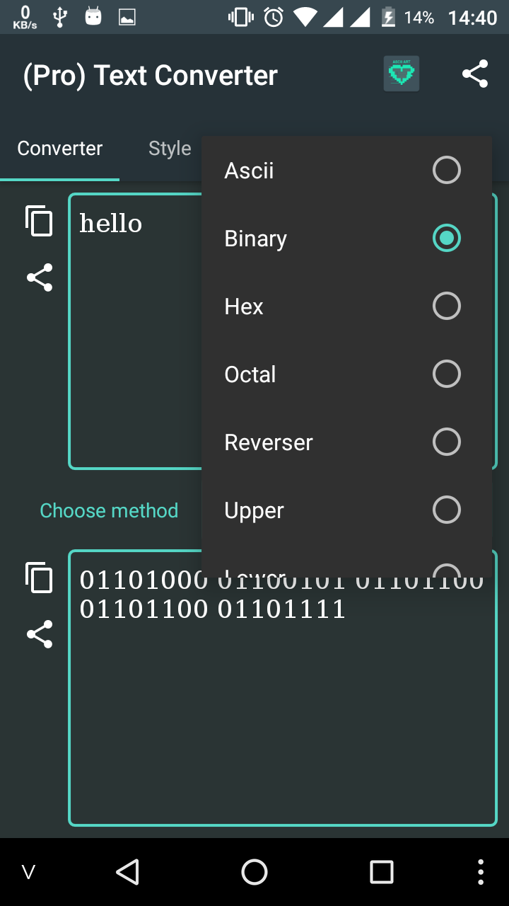
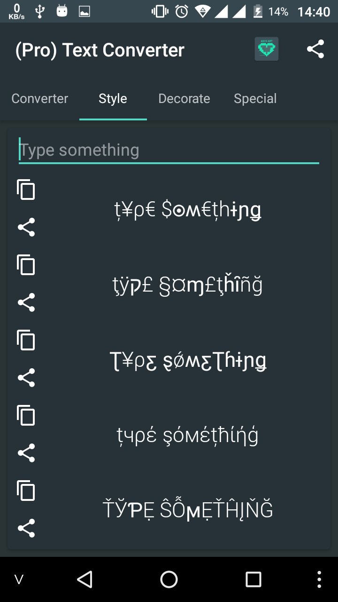
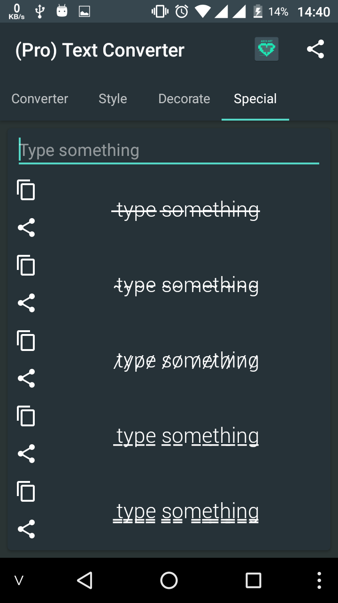

# Text Converter
Send your friends the most special text and mysterious text (Android)

### PLEASE DON'T RE UP THIS APPLICATION. USE THIS APP FOR YOUR STUDY OR RESEARCH

# Features
## Codec
- Ascii encoder/decoder
- Binary encoder/decoder (a -> 01100001)
- Hex encoder/decoder
- Octal encoder/decoder
- Reverser text (abc def -> fed cba) encoder/decoder
- Upper case text (abc -> ABC) encoder/decoder
- Lower case text (ABC -> abc) encoder/decoder
- Upside down text (hello -> oןןǝɥ)
- Supper script ᵃᵇᶜᵈᵉᶠᵍʰⁱʲᵏˡᵐⁿᵒᵖqʳˢᵗᵘᵛʷˣʸᶻ_,;.?!/\'ᴬᴮᶜᴰᴱᶠᴳᴴᴵᴶᴷᴸᴹᴺᴼᴾQᴿˢᵀᵁⱽᵂˣʸᶻ⁰¹²³⁴⁵⁶⁷⁸⁹
- Sub script ₐbcdₑfgₕᵢⱼₖₗₘₙₒₚqᵣₛₜᵤᵥwₓyz_,;.?!/\'ₐBCDₑFGₕᵢⱼₖₗₘₙₒₚQᵣₛₜᵤᵥWₓYZ₀₁₂₃₄₅₆₇₈₉
- International morse code encoder/decoder
- Zalgo Big/Normal/Mini encoder/decoder
- Base 32 encoder/decoder
- Base 64 encoder/decoder
- Url encoder/decoder
- Random case
- Caesar
- Atbash encoder/decoder
- ROT-13 codec
- Nato codec
- Unicode encoder/decoder
- Wingding encoder/decoder

## Barcode encoder/decoder
- AZTEC
- CODABAR
- CODE_39
- CODE_128,
- EAN_8
- EAN_13
- ITF
- PDF_417,
- QR_CODE
- UPC_A

## Stylish text & decorate text generator
- More than 200 style

## Hash
- MD5
- SHA-1
- SHA-256
- SHA-384
- SHA-512

## Base converter
Convert from base to other base (Hex, decmial, octal, binary)

## Cipher
- Caesar
- Vignere

## More feature
- Frequency analysis

### Some Image

